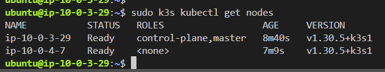
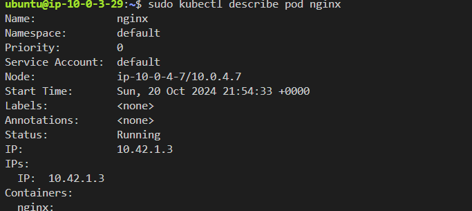

# Task 3: K8s Cluster Configuration and Creation

## Objective

In this task, you will configure and deploy a Kubernetes (K8s) cluster on AWS using either kOps or k3s. You will also verify the cluster by running a simple workload.

## Description

1. **main.tf**
    - Contains bare terraform object
        - Assumes you have s3 bucket and dynamodb table

2. **compute.tf**
    - Contains 5 ec2 instance resources
        - 1 Bastion EC2
        - 2 t3.medium EC2 instances for k3s
3. **networks.tf**
    - provide:
        - vpc
        - 1 public subnet for bastion host with elastic IP for connection
        - 2 private subnets: one for master/control plane and one for worker
        - public route table with internet gateway for connection with internet (in/out)
        - nat gateway with elastic IP for private subnet for outbound connection in private route table
4. **security_groups.tf**
    - provide:
        - bastion security group:
            - allow ssh inbound connection
        - private master security group:
            - inbound ssh from bastion sg
            - inbound 6443 for connection from worker node
        - private worker security group
            - inbound ssh from bastion sg
            - inbound 10250 for connection from master node
5. **ssh.tf**
    - ssh key resource 
6. **variables.tf**
    - all variables used
7. **terraform.tfvars**
    - gitignored

## Create k3s cluster with one pod
- copy ssh private key into bastion host

    `scp -i ssh/ec2-bastion.pem ssh/ec2-bastion.pem ubuntu@bastion-ip:~/.ssh/id_rsa`
- connect to bastion host

    `ssh -i ssh/ec2-bastion.pem ubuntu@bastion-ip`
- connect to master node

    `ssh ubuntu@master-ip`
- install k3s server: master plane:
    `curl -sfL https://get.k3s.io | sudo sh -`

- get K3s token for worker nodes and copy it for later use

    `sudo cat /var/lib/rancher/k3s/server/token`
- connect ot worker node

    `ssh ubuntu@worker-ip`
- install k3s to join the cluster

    `curl -sfL https://get.k3s.io | K3S_URL=https://master-ip:6443 K3S_TOKEN="token you copied" sh -`

- login back to master and see nodes

    `sudo k3s kubectl get nodes`
    
    result is: 

- Deploy a simple workload on the cluster using the following command:

    `kubectl apply -f https://k8s.io/examples/pods/simple-pod.yaml`
    
    result is that it is running in worker node: 